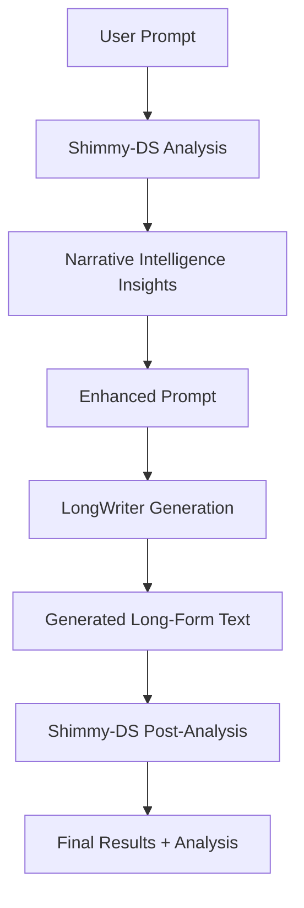

# Shimmy-DS + LongWriter Integration Guide

This guide explains how to integrate Shimmy-DS's recursive narrative intelligence with LongWriter's long-form generation capabilities.

## 🎯 Integration Overview

**Shimmy-DS** provides narrative intelligence (CAPR tracking, character consistency, etc.)
**LongWriter** provides long-form generation capabilities (up to 32K+ tokens)

**Combined Result**: Intelligent long-form generation with narrative coherence

## 📋 Prerequisites

### 1. Shimmy-DS Setup (Already Done)
```bash
# Your Shimmy-DS is already compiled and working
cd D:\shimmy-DS
cargo build --release --no-default-features --features huggingface
```

### 2. LongWriter Setup
```bash
# Clone LongWriter repository
git clone https://github.com/THUDM/LongWriter.git
cd LongWriter

# Install dependencies
pip install torch transformers datasets
pip install flash-attn --no-build-isolation  # Optional, for speed
pip install aiohttp asyncio  # For integration script
```

### 3. Model Download
LongWriter will automatically download the model on first use:
- **Model**: `THUDM/LongWriter-llama3.1-8b` (16GB)
- **Requirements**: ~20GB VRAM for GPU, or 32GB+ RAM for CPU

## 🚀 Quick Start

### 1. Start Shimmy-DS Server
```bash
cd D:\shimmy-DS
./target/release/shimmy.exe serve
```

### 2. Run the Integration
```bash
cd D:\shimmy-DS
python scripts/longwriter_integration.py \
  --prompt "Write a long science fiction story about recursive time loops where each loop reveals deeper truths about reality. The protagonist must navigate multiple layers of nested temporal paradoxes." \
  --max-length 20000 \
  --output story_output.json
```

## 🔧 Integration Workflow



### Step-by-Step Process

1. **Initial Analysis**: Shimmy-DS analyzes the prompt for narrative patterns
2. **Prompt Enhancement**: Add narrative intelligence guidance to the prompt
3. **Long Generation**: LongWriter generates extended content (up to 32K tokens)
4. **Post-Analysis**: Shimmy-DS analyzes the generated content for quality
5. **Results**: Combined output with narrative insights and suggestions

## 📝 Usage Examples

### Example 1: Creative Fiction
```bash
python scripts/longwriter_integration.py \
  --prompt "Elena discovered that every mirror in her grandmother's house showed a different version of reality. As she stepped through the first mirror..." \
  --max-length 15000 \
  --temperature 0.8
```

### Example 2: Technical Writing
```bash
python scripts/longwriter_integration.py \
  --prompt "Write a comprehensive guide to implementing recursive algorithms in distributed systems, covering theory, practical examples, and edge cases." \
  --max-length 25000 \
  --temperature 0.6
```

### Example 3: Interactive Fiction
```bash
python scripts/longwriter_integration.py \
  --prompt "Create a branching narrative where the reader makes choices that affect a detective investigating a series of impossible crimes in a city where reality itself is unstable." \
  --max-length 30000 \
  --temperature 0.7
```

## ⚡ Performance Optimization

### GPU Setup (Recommended)
```bash
# For NVIDIA GPUs with CUDA
python scripts/longwriter_integration.py \
  --prompt "Your prompt here" \
  --device cuda \
  --max-length 32000
```

### CPU Setup (Slower but works)
```bash
# For CPU-only systems
python scripts/longwriter_integration.py \
  --prompt "Your prompt here" \
  --device cpu \
  --max-length 16000  # Reduce length for CPU
```

### Memory Optimization
```bash
# For systems with limited memory
export PYTORCH_CUDA_ALLOC_CONF=max_split_size_mb:512
python scripts/longwriter_integration.py \
  --prompt "Your prompt here" \
  --max-length 10000
```

## 📊 Output Format

The integration produces JSON output with:

```json
{
  "original_prompt": "User's original prompt",
  "enhanced_prompt": "Prompt enhanced with narrative intelligence",
  "generated_text": "Long-form generated content",
  "initial_insights": {
    "health_score": 0.85,
    "patterns": ["CAPR loop detected", "Character arc: Elena"],
    "character_guidance": ["Elena: Self-discovery arc at 60% completion"],
    "suggestions": ["Focus on narrative coherence"]
  },
  "post_analysis": {
    "analysis": "Detailed narrative analysis of generated content",
    "final_health_score": 0.91,
    "identified_patterns": ["Recursive mirror theme", "Reality questioning"],
    "suggestions": ["Strong narrative coherence achieved"]
  },
  "metrics": {
    "word_count": 8742,
    "character_count": 52486,
    "enhancement_count": 15
  }
}
```

## 🎛️ Configuration Options

### LongWriter Parameters
- `--max-length`: Maximum tokens to generate (default: 16000)
- `--temperature`: Creativity level 0.1-1.0 (default: 0.7)
- `--model`: LongWriter model to use (default: THUDM/LongWriter-llama3.1-8b)

### Shimmy-DS Parameters
- `--shimmy-url`: Shimmy-DS server URL (default: http://127.0.0.1:11435)

### System Parameters
- `--device`: Processing device (auto/cuda/cpu/mps)
- `--output`: Save results to file

## 🔍 Narrative Intelligence Features

The integration leverages Shimmy-DS's full narrative intelligence:

### CAPR Loop Analysis
- Tracks Contradiction→Action→Pressure→Return patterns
- Ensures recursive themes are properly developed

### Character Consistency
- Monitors character voice and personality
- Tracks character development arcs

### Constraint Space Modeling
- Maps narrative possibilities
- Ensures story coherence

### Engagement Optimization
- Monitors reader engagement patterns
- Suggests pacing improvements

### Drift Stabilization
- Prevents narrative drift in long-form content
- Maintains thematic consistency

## 🛠️ Troubleshooting

### Common Issues

1. **CUDA Out of Memory**
   ```bash
   # Reduce max_length or use CPU
   python scripts/longwriter_integration.py --device cpu --max-length 8000
   ```

2. **Shimmy-DS Connection Failed**
   ```bash
   # Check if Shimmy-DS is running
   curl http://127.0.0.1:11435/v1/models
   ```

3. **Model Download Issues**
   ```bash
   # Pre-download the model
   python -c "from transformers import AutoTokenizer, AutoModelForCausalLM; AutoTokenizer.from_pretrained('THUDM/LongWriter-llama3.1-8b'); AutoModelForCausalLM.from_pretrained('THUDM/LongWriter-llama3.1-8b')"
   ```

4. **Slow Generation**
   ```bash
   # Use GPU and reduce length
   python scripts/longwriter_integration.py --device cuda --max-length 10000
   ```

### Performance Tips

1. **Use GPU when available** (10-20x faster)
2. **Start with shorter lengths** (8K-16K tokens) for testing
3. **Adjust temperature** based on content type (0.6 for technical, 0.8 for creative)
4. **Monitor memory usage** with `nvidia-smi` or Task Manager

## 🔗 API Integration

You can also use the integration programmatically:

```python
import asyncio
from scripts.longwriter_integration import LongWriterShimmyIntegration

async def generate_story():
    async with LongWriterShimmyIntegration() as integration:
        result = await integration.generate_intelligent_longform(
            prompt="Your story prompt here",
            max_length=20000,
            temperature=0.7
        )
        return result

# Run the generation
result = asyncio.run(generate_story())
print(f"Generated {result['metrics']['word_count']} words")
```

## 🎯 Use Cases

### Perfect For:
- **Long-form creative writing** with narrative intelligence
- **Interactive fiction** with consistent world-building
- **Technical documentation** with structural coherence
- **Academic papers** with logical flow
- **Screenplays and scripts** with character consistency

### Performance Expectations:
- **Quality**: High narrative coherence + long-form capability
- **Speed**: 2-10 minutes for 16K tokens (GPU), 10-60 minutes (CPU)
- **Memory**: 16-20GB VRAM (GPU) or 32GB+ RAM (CPU)

This integration gives you the best of both worlds: Shimmy-DS's world-first recursive narrative intelligence combined with LongWriter's extended generation capabilities!