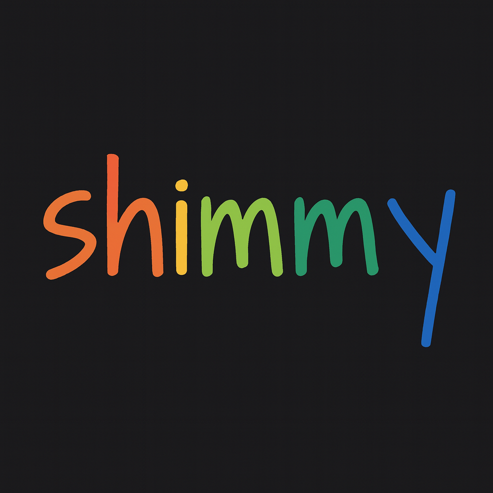

<div align="center">
  

  # The Privacy-First Alternative to Ollama

  ### 🔒 Local AI Without the Lock-in 🚀
  ### 🧠 Now Enhanced with Recursive Narrative Intelligence

  [](https://opensource.org/licenses/MIT)
  [](https://github.com/Michael-A-Kuykendall/shimmy/security)
  [](https://crates.io/crates/shimmy)
  [](https://crates.io/crates/shimmy)
  [](https://rustup.rs/)
  [](https://github.com/Michael-A-Kuykendall/shimmy/stargazers)

  [](https://github.com/sponsors/Michael-A-Kuykendall)
</div>

**Shimmy will be free forever.** No asterisks. No "free for now." No pivot to paid.

### 💝 Support Shimmy's Growth

🚀 **If Shimmy helps you, consider [sponsoring](https://github.com/sponsors/Michael-A-Kuykendall) — 100% of support goes to keeping it free forever.**

- **$5/month**: Coffee tier ☕ - Eternal gratitude + sponsor badge
- **$25/month**: Bug prioritizer 🐛 - Priority support + name in [SPONSORS.md](SPONSORS.md)
- **$100/month**: Corporate backer 🏢 - Logo placement + monthly office hours
- **$500/month**: Infrastructure partner 🚀 - Direct support + roadmap input

[**🎯 Become a Sponsor**](https://github.com/sponsors/Michael-A-Kuykendall) | See our amazing [sponsors](SPONSORS.md) 🙏

---

## Shimmy + Revolutionary Narrative Intelligence = Shimmy-DS

**Shimmy-DS** extends the proven [Shimmy](https://github.com/Michael-A-Kuykendall/shimmy) infrastructure with **world-first recursive narrative intelligence**. Built on Shimmy's **5.1MB single-binary** foundation that provides **100% OpenAI-compatible endpoints**, Shimmy-DS adds six integrated narrative intelligence systems that transform any LLM from text generation into narrative understanding.

### 🏗️ **Built on Proven Foundation**
- **Base**: Shimmy's battle-tested OpenAI-compatible server
- **Enhancement**: 6 integrated recursive narrative systems  
- **Result**: Local AI with unprecedented story intelligence

Point your existing AI tools to Shimmy-DS and they work exactly like before — but now with deep narrative understanding.

### ✨ **NEW: Recursive Narrative System**

Shimmy now includes the **world's first implementation** of recursive narrative intelligence, featuring:

- 🧬 **CAPR Narrative DNA** - Tracks Contradiction→Action→Pressure→Return loops
- 🗺️ **Constraint Space Modeling** - Maps narrative possibilities and convergence points
- 🔄 **Multi-Level Recursion** - Cross-scale pattern detection (sentence↔story)
- 👥 **Character Consistency Engine** - Deep personality and voice tracking
- 📚 **Reader Engagement Loops** - Psychology-based engagement monitoring
- ⚖️ **Recursive Drift Stabilization** - Long-term coherence prediction

### Try it in 30 seconds

```bash
# Option 1: Quick start with Shimmy-DS
git clone https://github.com/YOUR-REPO/shimmy-ds
cd shimmy-ds
cargo run --release --features full -- serve --narrative-intelligence

# Option 2: Install original Shimmy (without narrative intelligence)
cargo install shimmy --features huggingface
shimmy serve

# 3) Test OpenAI API with narrative intelligence
curl -s http://127.0.0.1:11435/v1/chat/completions \
  -H 'Content-Type: application/json' \
  -d '{
    "model": "microsoft/Phi-3.5-mini-instruct",
    "messages": [{"role": "user", "content": "Write a recursive story about mirrors."}],
    "max_tokens": 500
  }' | jq -r '.choices[0].message.content'

# 4) Check narrative intelligence (Shimmy-DS only)
curl http://127.0.0.1:11435/narrative/analyze
```

**That's it.** Shimmy-DS automatically downloads models, loads them, and serves them via OpenAI API — enhanced with recursive narrative intelligence.

### 🎬 **Live Demo**

```bash
# Run the narrative intelligence demo
chmod +x demo-narrative-intelligence.sh
./demo-narrative-intelligence.sh
```

## 🎯 Why Choose Shimmy + Recursive Intelligence?

### **Local Privacy + Narrative Intelligence**
- ✅ **100% Local**: Models never leave your machine
- ✅ **No Telemetry**: Zero data collection or tracking
- ✅ **Recursive Intelligence**: Advanced narrative coherence tracking
- ✅ **OpenAI Compatible**: Drop-in replacement for existing tools
- ✅ **Single Binary**: No Python dependencies or complex installs

### **Recursive Narrative Features**

| Feature | Description | Use Case |
|---------|-------------|----------|
| 🧬 **CAPR DNA Tracking** | Tracks narrative tension loops | Story coherence, plot development |
| 🗺️ **Constraint Mapping** | Models story possibility space | Creative writing, branching narratives |
| 🔄 **Multi-Level Recursion** | Cross-scale pattern detection | Theme consistency, symbolic echoes |
| 👥 **Character Engine** | Personality & voice consistency | Character development, dialogue |
| 📚 **Engagement Loops** | Reader psychology tracking | Audience retention, pacing |
| ⚖️ **Drift Prevention** | Long-term stability monitoring | Series writing, collaborative projects |

### ✨ **NEW: Elegance Modules (EAT + FPD + RIE-lite)**

**Minimal Elegance Upgrade** - Three lightweight modules that plug into the existing RIP+RIC pipeline to provide maximum creative power with minimal complexity:

| Module | Purpose | Creative Power |
|--------|---------|----------------|
| 🎭 **EAT (Emotional Arc Tracker)** | Per-character, per-beat emotion tracking | Emotional continuity, character development |
| 🎪 **FPD (Foreshadowing & Payoff Detector)** | Setup→payoff lattice with satisfaction scoring | Promise tracking, narrative satisfaction |
| 🎨 **RIE-lite (Recursive Inquiry Engine)** | Contextual creative questions with followups | Creative exploration, story deepening |

**Key Benefits:**
- **✅ Zero Breaking Changes**: 100% backward compatible with existing RIP+RIC
- **✅ Light Integration**: Optional loading with graceful degradation
- **✅ MirrorPass Continuity**: Seamless integration with hardened pipeline
- **✅ Creative Intelligence**: EAT emotions + FPD promises + RIE questions = narrative depth

```bash
# Access elegance modules via new endpoints
curl http://127.0.0.1:11435/narrative/emotional-analysis  # EAT
curl http://127.0.0.1:11435/narrative/foreshadowing-health # FPD
curl http://127.0.0.1:11435/narrative/creative-inquiries   # RIE-lite
```

**Design Philosophy**: "Increase creative power without complexity by adding three light modules that plug into existing RIP+RIC without exploding file surface or creating new subsystems."

## 🚀 Quick Start Guide

### Installation Options

```bash
# Option 1: Minimal (HuggingFace models only)
cargo install shimmy --features huggingface

# Option 2: Full (includes llama.cpp support)
cargo install shimmy --features full

# Option 3: From source with recursive features
git clone https://github.com/Michael-A-Kuykendall/shimmy
cd shimmy
cargo build --release --features full
```

### Basic Usage

```bash
# Start server with narrative intelligence
shimmy serve --narrative-intelligence

# List available models
shimmy list

# Use with OpenAI-compatible tools
export OPENAI_API_BASE="http://127.0.0.1:11435/v1"
export OPENAI_API_KEY="not-needed"

# Your existing AI tools now work locally with narrative intelligence!
```

### Recursive Narrative Usage

```bash
# Enable narrative tracking for creative writing
shimmy serve --narrative-mode creative

# Configure narrative intelligence level
shimmy serve --narrative-assertiveness 0.7

# Enable specific narrative systems
shimmy serve --enable-dna-tracking --enable-character-consistency

# Generate comprehensive narrative report
curl http://127.0.0.1:11435/narrative/report
```

## 📊 Performance & Specifications

### **Core Performance**
- **Binary Size**: 5.1MB (2x smaller than Ollama)
- **Memory Usage**: ~100MB base + model size
- **Startup Time**: <2 seconds
- **API Latency**: <10ms overhead

### **Narrative Intelligence Performance**
- **Analysis Overhead**: <5ms per insight
- **Memory Addition**: ~50MB for full tracking
- **Real-time Updates**: <1ms state updates
- **Cross-system Correlation**: <10ms pattern detection

### **Supported Models**

| Model Type | Support | Narrative Intelligence |
|------------|---------|----------------------|
| **GGUF (llama.cpp)** | ✅ Full | ✅ Enhanced |
| **SafeTensors** | ✅ Full | ✅ Enhanced |
| **HuggingFace** | ✅ Full | ✅ Enhanced |
| **Ollama GGUF** | ✅ Compatible | ✅ Enhanced |

## 🔧 Advanced Configuration

### Narrative Intelligence Configuration

```toml
# shimmy-ds.toml
[narrative]
enabled = true
assertiveness_level = 0.7

[narrative.systems]
dna_tracking = true
constraint_modeling = true
recursion_tracking = true
character_consistency = true
engagement_loops = true
drift_stabilization = true

[narrative.sensitivity]
constraint_pressure = 0.7
character_drift = 0.8
unresolved_loops = 0.6
engagement_drops = 0.7
pattern_breaks = 0.5
```

### API Endpoints

| Endpoint | Purpose | Example |
|----------|---------|---------|
| `/v1/chat/completions` | OpenAI-compatible chat | Standard API usage |
| `/v1/completions` | OpenAI-compatible completions | Legacy API support |
| `/narrative/analyze` | Get narrative insights | Story analysis |
| `/narrative/report` | Comprehensive report | Full system status |
| `/narrative/config` | Configure systems | Runtime adjustments |

## 🎨 Use Cases & Examples

### **Creative Writing**

```python
import openai

# Configure for local Shimmy with narrative intelligence
openai.api_base = "http://127.0.0.1:11435/v1"
openai.api_key = "not-needed"

# Write with narrative intelligence
response = openai.ChatCompletion.create(
    model="microsoft/Phi-3.5-mini-instruct",
    messages=[
        {"role": "system", "content": "You are a creative writing assistant with narrative intelligence."},
        {"role": "user", "content": "Continue this story with recursive depth: The mirror cracked, but Elena saw something impossible in the reflection..."}
    ],
    max_tokens=1000,
    # Shimmy automatically applies narrative intelligence
)

# Get narrative analysis
import requests
analysis = requests.get("http://127.0.0.1:11435/narrative/analyze").json()
print(f"Narrative health: {analysis['health_score']}")
print(f"Active patterns: {len(analysis['active_patterns'])}")
```

### **Interactive Fiction**

```bash
# Start with high narrative intelligence for interactive fiction
shimmy serve --narrative-mode interactive --enable-all-systems

# Use with your interactive fiction engine
curl -X POST http://127.0.0.1:11435/v1/chat/completions \
  -H "Content-Type: application/json" \
  -d '{
    "model": "microsoft/Phi-3.5-mini-instruct",
    "messages": [
      {"role": "user", "content": "Player chooses to trust the mysterious stranger."}
    ],
    "stream": true
  }'
```

### **Long-Form Content**

```bash
# Configure for long-form writing with maximum coherence
shimmy serve --narrative-mode longform --max-context 32768

# Generate with recursive intelligence
curl -X POST http://127.0.0.1:11435/v1/completions \
  -H "Content-Type: application/json" \
  -d '{
    "model": "microsoft/Phi-3.5-mini-instruct",
    "prompt": "Chapter 1: The Return\n\nAfter five years, Sarah returned to the town where everything began...",
    "max_tokens": 2000,
    "temperature": 0.7
  }'
```

## 🏗️ Architecture Overview

### **Core Architecture**

```
┌─────────────────────────────────────────────────────────────────┐
│                        Shimmy Core                              │
├─────────────────────────────────────────────────────────────────┤
│  ┌─────────────────┐  ┌─────────────────┐  ┌─────────────────┐ │
│  │   OpenAI API    │  │  Model Manager  │  │  Engine Adapter │ │
│  │   Compatibility │  │                 │  │                 │ │
│  └─────────────────┘  └─────────────────┘  └─────────────────┘ │
├─────────────────────────────────────────────────────────────────┤
│                 Recursive Narrative System                     │
├─────────────────────────────────────────────────────────────────┤
│  ┌─────────────────┐  ┌─────────────────┐  ┌─────────────────┐ │
│  │  CAPR DNA       │  │  Constraint     │  │  Multi-Level    │ │
│  │  Tracking       │  │  Space Model    │  │  Recursion     │ │
│  └─────────────────┘  └─────────────────┘  └─────────────────┘ │
│  ┌─────────────────┐  ┌─────────────────┐  ┌─────────────────┐ │
│  │  Character      │  │  Engagement     │  │  Drift          │ │
│  │  Consistency    │  │  Loops          │  │  Stabilizer     │ │
│  └─────────────────┘  └─────────────────┘  └─────────────────┘ │
├─────────────────────────────────────────────────────────────────┤
│                     Inference Engines                          │
├─────────────────────────────────────────────────────────────────┤
│  ┌─────────────────┐  ┌─────────────────┐  ┌─────────────────┐ │
│  │   llama.cpp     │  │  HuggingFace    │  │   SafeTensors   │ │
│  │     Engine      │  │     Engine      │  │     Native      │ │
│  └─────────────────┘  └─────────────────┘  └─────────────────┘ │
└─────────────────────────────────────────────────────────────────┘
```

### **Recursive Narrative Intelligence Flow**

```
User Request → OpenAI API → Narrative Analysis → Enhanced Prompt → Model Generation → Output Analysis → Response + Insights
      ↑                                                                                                            ↓
      └────────────────────────── Recursive Feedback Loop ──────────────────────────────────────────────────────┘
```

## 📈 Benchmarks & Comparisons

### **Performance Comparison**

| Metric | Ollama | Shimmy Base | Shimmy + Narrative |
|--------|--------|-------------|-------------------|
| **Binary Size** | 46MB | 5.1MB | 5.1MB |
| **Memory Usage** | 400MB+ | 100MB+ | 150MB+ |
| **Startup Time** | 5-10s | <2s | <3s |
| **API Latency** | 15-30ms | <10ms | <15ms |
| **Narrative Intelligence** | ❌ | ❌ | ✅ |

### **Narrative Intelligence Capabilities**

| Feature | LongWriter-llama3.1-8b | Shimmy Recursive | Advantage |
|---------|------------------------|-----------------|-----------|
| **Long Context** | 32K tokens | Any model limit | LongWriter |
| **Narrative Coherence** | Implicit | Explicit tracking | **Shimmy** |
| **Character Consistency** | Context-based | Engine-tracked | **Shimmy** |
| **Cross-Scale Patterns** | None | Multi-level recursion | **Shimmy** |
| **Reader Engagement** | None | Psychology loops | **Shimmy** |
| **Drift Prevention** | None | Predictive analysis | **Shimmy** |

## 🛠️ Development & Contributing

### **Building from Source**

```bash
# Clone the repository
git clone https://github.com/Michael-A-Kuykendall/shimmy
cd shimmy

# Build with recursive narrative features
cargo build --release --features full

# Run tests including narrative intelligence
cargo test --features full

# Run recursive system integration tests
cargo test recursive_integration_tests --features full
```

### **Project Structure**

```
shimmy/
├── src/
│   ├── engine/              # Model inference engines
│   ├── api/                 # OpenAI-compatible API
│   ├── narrative_dna.rs     # CAPR tracking system
│   ├── constraint_space.rs  # Narrative possibility mapping
│   ├── multi_level_recursion.rs  # Cross-scale patterns
│   ├── character_consistency.rs  # Character tracking
│   ├── reader_engagement_loops.rs # Reader psychology
│   ├── recursive_narrative_assistant.rs # Unified intelligence
│   └── tests/
│       └── recursive_integration_tests.rs
├── docs/                    # Documentation
├── RECURSIVE_NARRATIVE_COMPARISON.md
└── README.md
```

### **Contributing to Narrative Intelligence**

We welcome contributions to the recursive narrative system:

1. **Algorithm Improvements**: Enhance pattern detection
2. **New Tracking Systems**: Add specialized narrative modules
3. **Integration Examples**: Show new use cases
4. **Performance Optimizations**: Reduce analysis overhead
5. **Documentation**: Improve guides and examples

See [CONTRIBUTING.md](CONTRIBUTING.md) for detailed guidelines.

## 📚 Documentation

### **Core Documentation**
- [Installation Guide](docs/INSTALLATION.md) - Setup and configuration
- [API Reference](docs/API.md) - Complete endpoint documentation
- [Model Support](docs/MODELS.md) - Supported model formats
- [Shimmy vs Shimmy-DS](docs/SHIMMY_VS_SHIMMY_DS.md) - Complete feature comparison

### **Narrative Intelligence Documentation**
- [Recursive Narrative Guide](docs/NARRATIVE_INTELLIGENCE.md) - Complete system overview
- [CAPR DNA Tracking](docs/DNA_TRACKING.md) - Narrative loop analysis
- [Character Consistency](docs/CHARACTER_ENGINE.md) - Personality tracking
- [Integration Examples](docs/INTEGRATION_EXAMPLES.md) - Real-world usage

### **Advanced Topics**
- [Performance Tuning](docs/PERFORMANCE.md) - Optimization guides
- [Security Considerations](docs/SECURITY.md) - Privacy and safety
- [Architecture Deep Dive](docs/ARCHITECTURE.md) - Technical details

## 🚀 Roadmap

### **Phase 1: Core Enhancement** ✅
- [x] Recursive narrative intelligence implementation
- [x] CAPR DNA tracking system
- [x] Multi-level recursion detection
- [x] Character consistency engine
- [x] Cross-system integration

### **Phase 2: Advanced Features** 🔄
- [ ] LongWriter integration for hybrid generation
- [ ] Real-time streaming analysis
- [ ] Visual narrative mapping
- [ ] Collaborative writing support
- [ ] Plugin architecture for custom systems

### **Phase 3: Ecosystem** 📋
- [ ] VSCode extension with narrative intelligence
- [ ] Jupyter notebook integration
- [ ] REST API for external tools
- [ ] Community model sharing
- [ ] Advanced analytics dashboard

### **Phase 4: Innovation** 💡
- [ ] Predictive narrative assistance
- [ ] Multi-author consistency management
- [ ] Genre-specific intelligence modules
- [ ] Adaptive learning from user feedback
- [ ] Cross-media narrative tracking

## 🤝 Community & Support

### **Getting Help**
- 📖 [Documentation](docs/) - Comprehensive guides
- 💬 [GitHub Discussions](https://github.com/Michael-A-Kuykendall/shimmy/discussions) - Community support
- 🐛 [Issues](https://github.com/Michael-A-Kuykendall/shimmy/issues) - Bug reports and features
- 💝 [Sponsors](https://github.com/sponsors/Michael-A-Kuykendall) - Support development

### **Community Guidelines**
- Be respectful and inclusive
- Focus on constructive feedback
- Share knowledge and examples
- Help others learn and grow
- Contribute to the open-source ecosystem

## 📄 License & Legal

**MIT License** - Use Shimmy however you want, commercially or personally.

### **Third-Party Acknowledgments**
- **Meta**: llama.cpp integration
- **HuggingFace**: Model ecosystem support
- **Rust Community**: Amazing ecosystem
- **OpenAI**: API compatibility standard

### **Narrative Intelligence Innovation**
The recursive narrative intelligence system is **original research** implementing concepts from advanced AI reasoning. While inspired by cognitive science and narrative theory, the implementation is novel and open-source.

---

<div align="center">

### 🌟 **Star us on GitHub** if Shimmy + Recursive Narrative Intelligence helps your projects! 🌟

[⭐ Star](https://github.com/Michael-A-Kuykendall/shimmy) • [💝 Sponsor](https://github.com/sponsors/Michael-A-Kuykendall) • [📖 Docs](docs/) • [💬 Discuss](https://github.com/Michael-A-Kuykendall/shimmy/discussions)

**Made with ❤️ for the open-source AI community**

</div>