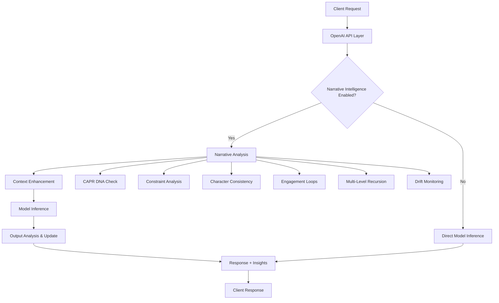

# 🏗️ Shimmy-DS Architecture Deep Dive

## Technical Architecture Overview

---

## 🎯 System Architecture

### **High-Level Architecture**

```
┌─────────────────────────────────────────────────────────────────┐
│                      Client Applications                       │
│  ┌─────────────────┐  ┌─────────────────┐  ┌─────────────────┐ │
│  │   OpenAI API    │  │  Python Tools   │  │  Custom Apps    │ │
│  │    Clients      │  │                 │  │                 │ │
│  └─────────────────┘  └─────────────────┘  └─────────────────┘ │
└─────────────────────────────────────────────────────────────────┘
                                    │
                    HTTP/JSON API (OpenAI Compatible)
                                    │
┌─────────────────────────────────────────────────────────────────┐
│                        Shimmy Core                              │
├─────────────────────────────────────────────────────────────────┤
│  ┌─────────────────┐  ┌─────────────────┐  ┌─────────────────┐ │
│  │   OpenAI API    │  │  Model Manager  │  │  Engine Adapter │ │
│  │   Compatibility │  │     Registry    │  │     Layer       │ │
│  └─────────────────┘  └─────────────────┘  └─────────────────┘ │
├─────────────────────────────────────────────────────────────────┤
│                 Recursive Narrative System                     │
├─────────────────────────────────────────────────────────────────┤
│  ┌─────────────────┐  ┌─────────────────┐  ┌─────────────────┐ │
│  │  CAPR DNA       │  │  Constraint     │  │  Multi-Level    │ │
│  │  Tracking       │  │  Space Model    │  │  Recursion     │ │
│  └─────────────────┘  └─────────────────┘  └─────────────────┘ │
│  ┌─────────────────┐  ┌─────────────────┐  ┌─────────────────┐ │
│  │  Character      │  │  Engagement     │  │  Drift          │ │
│  │  Consistency    │  │  Loops          │  │  Stabilizer     │ │
│  └─────────────────┘  └─────────────────┘  └─────────────────┘ │
├─────────────────────────────────────────────────────────────────┤
│                     Inference Engines                          │
├─────────────────────────────────────────────────────────────────┤
│  ┌─────────────────┐  ┌─────────────────┐  ┌─────────────────┐ │
│  │   llama.cpp     │  │  HuggingFace    │  │   SafeTensors   │ │
│  │     Engine      │  │     Engine      │  │     Native      │ │
│  └─────────────────┘  └─────────────────┘  └─────────────────┘ │
└─────────────────────────────────────────────────────────────────┘
```

### **Request Flow with Narrative Intelligence**



---

## 🧠 Recursive Narrative System Architecture

### **Component Interaction Diagram**

```
                    RecursiveNarrativeAssistant
                             (Coordinator)
                                  │
        ┌─────────────────────────┼─────────────────────────┐
        │                        │                         │
        ▼                        ▼                         ▼
┌─────────────┐        ┌─────────────┐         ┌─────────────┐
│   DNA       │        │ Constraint  │         │Multi-Level  │
│ Tracker     │◄──────►│   Space     │◄──────► │ Recursion   │
│             │        │  Tracker    │         │  Tracker    │
└─────────────┘        └─────────────┘         └─────────────┘
        │                        │                         │
        │                        ▼                         │
        │              ┌─────────────┐                     │
        │              │ Character   │                     │
        └─────────────►│Consistency  │◄────────────────────┘
                       │  Engine     │
                       └─────────────┘
                               │
                               ▼
                    ┌─────────────┐         ┌─────────────┐
                    │Engagement   │◄──────► │   Drift     │
                    │   Loops     │         │ Stabilizer  │
                    └─────────────┘         └─────────────┘
```

### **Data Flow Between Systems**

```rust
// Simplified interaction flow
pub fn process_narrative_update(&mut self) {
    // 1. DNA system identifies patterns
    let dna_insights = self.dna_tracker.analyze_patterns();

    // 2. Constraint system evaluates freedom
    let constraint_pressure = self.constraint_tracker.calculate_pressure();

    // 3. Character system checks consistency
    let character_issues = self.character_engine.detect_violations();

    // 4. Cross-system correlation
    let cross_patterns = self.correlate_systems(&dna_insights, &constraint_pressure, &character_issues);

    // 5. Generate unified insights
    let insights = self.synthesize_insights(cross_patterns);

    // 6. Update all systems based on new information
    self.propagate_updates(insights);
}
```

---

## 🔧 Core System Components

### **1. OpenAI API Compatibility Layer**

```rust
// API endpoint structure
pub struct OpenAIEndpoint {
    pub path: String,
    pub method: HttpMethod,
    pub handler: RequestHandler,
    pub narrative_enhancement: bool,
}

// Request processing pipeline
impl ApiHandler {
    async fn process_request(&self, request: OpenAIRequest) -> Result<OpenAIResponse> {
        // 1. Parse and validate request
        let validated_request = self.validate_request(request)?;

        // 2. Apply narrative intelligence if enabled
        let enhanced_request = if self.config.narrative_enabled {
            self.narrative_assistant.enhance_request(validated_request).await?
        } else {
            validated_request
        };

        // 3. Route to appropriate inference engine
        let response = self.inference_engine.generate(enhanced_request).await?;

        // 4. Post-process with narrative analysis
        let final_response = if self.config.narrative_enabled {
            self.narrative_assistant.analyze_response(response).await?
        } else {
            response
        };

        Ok(final_response)
    }
}
```

### **2. Model Management System**

```rust
pub struct ModelRegistry {
    pub models: HashMap<String, ModelInfo>,
    pub active_models: HashMap<String, Box<dyn InferenceEngine>>,
    pub model_cache: LruCache<String, CachedModel>,
}

// Multi-engine support
pub trait InferenceEngine: Send + Sync {
    async fn generate(&self, request: &GenerationRequest) -> Result<GenerationResponse>;
    fn get_model_info(&self) -> &ModelInfo;
    fn supports_streaming(&self) -> bool;
    fn get_context_length(&self) -> usize;
}

// Engine implementations
impl InferenceEngine for LlamaCppEngine { /* llama.cpp integration */ }
impl InferenceEngine for HuggingFaceEngine { /* HF transformers */ }
impl InferenceEngine for SafeTensorsEngine { /* Native implementation */ }
```

### **3. Configuration Management**

```rust
// Hierarchical configuration system
pub struct ShimmyConfig {
    pub server: ServerConfig,
    pub models: ModelConfig,
    pub narrative: NarrativeConfig,
    pub performance: PerformanceConfig,
    pub security: SecurityConfig,
}

// Configuration sources (priority order)
pub enum ConfigSource {
    CommandLine,           // Highest priority
    EnvironmentVariables,
    ConfigFile,
    Defaults,             // Lowest priority
}

// Hot reload capability
impl ConfigManager {
    pub fn watch_for_changes(&mut self) -> Result<()> {
        // File system watcher for config files
        // Graceful hot reload without service interruption
    }
}
```

---

## 🧬 Narrative Intelligence Implementation

### **CAPR DNA Tracking System**

```rust
// DNA unit storage and indexing
pub struct NarrativeDNATracker {
    // Primary storage
    pub units: Vec<NarrativeDNAUnit>,

    // Fast lookup indices
    pub id_index: HashMap<String, usize>,
    pub type_index: HashMap<DNAUnitType, Vec<usize>>,
    pub character_index: HashMap<String, Vec<usize>>,
    pub temporal_index: BTreeMap<DateTime<Utc>, Vec<usize>>,

    // Analysis cache
    pub pattern_cache: LruCache<String, PatternAnalysis>,
    pub return_opportunity_cache: (DateTime<Utc>, Vec<ReturnOpportunity>),
}

// Efficient pattern analysis
impl NarrativeDNATracker {
    pub fn analyze_patterns(&self) -> DNAPatternAnalysis {
        // Use cached results when possible
        if let Some(cached) = self.pattern_cache.get("current_analysis") {
            if cached.timestamp > (Utc::now() - Duration::minutes(5)) {
                return cached.clone();
            }
        }

        // Compute analysis
        let analysis = self.compute_pattern_analysis();
        self.pattern_cache.put("current_analysis".to_string(), analysis.clone());
        analysis
    }
}
```

### **Constraint Space Modeling**

```rust
// Graph-based constraint representation
pub struct ConstraintGraph {
    pub nodes: HashMap<String, ConstraintNode>,
    pub edges: Vec<ConstraintEdge>,

    // Spatial indexing for efficient queries
    pub node_spatial_index: KdTree<ConstraintNode>,
    pub edge_lookup: HashMap<(String, String), usize>,

    // Constraint propagation cache
    pub propagation_cache: HashMap<String, ConstraintPropagation>,
}

// Efficient pathfinding and analysis
impl ConstraintSpaceTracker {
    pub fn calculate_freedom_score(&self) -> f32 {
        // Use graph algorithms for efficient computation
        let total_paths = self.count_total_paths();
        let available_paths = self.count_available_paths();

        if total_paths > 0 {
            available_paths as f32 / total_paths as f32
        } else {
            1.0
        }
    }

    // Dijkstra-based path analysis
    fn find_optimal_narrative_paths(&self) -> Vec<NarrativePath> {
        // Implementation using priority queue for efficiency
    }
}
```

### **Character Consistency Engine**

```rust
// Character data structure with efficient lookup
pub struct CharacterProfile {
    // Core identity
    pub name: String,
    pub traits: HashMap<String, PersonalityTrait>,

    // Voice analysis
    pub dialogue_pattern: DialogueFingerprint,
    pub voice_samples: VecDeque<DialogueSample>, // Bounded for efficiency

    // Relationship graph
    pub relationships: HashMap<String, RelationshipData>,

    // Temporal tracking
    pub timeline: BTreeMap<DateTime<Utc>, CharacterEvent>,
    pub consistency_history: VecDeque<ConsistencyCheck>,
}

// Voice consistency using NLP techniques
impl DialogueAnalyzer {
    pub fn analyze_voice_consistency(&self, new_dialogue: &str, character: &CharacterProfile) -> f32 {
        // Feature extraction
        let features = self.extract_linguistic_features(new_dialogue);

        // Compare against established patterns
        let baseline_features = character.dialogue_pattern.features.clone();
        let similarity = self.calculate_feature_similarity(&features, &baseline_features);

        // Update rolling average
        character.dialogue_pattern.update_with_sample(features);

        similarity
    }
}
```

### **Memory Management and Performance**

```rust
// Memory-efficient data structures
pub struct BoundedNarrativeHistory<T> {
    items: VecDeque<T>,
    max_size: usize,
    total_added: usize,
}

impl<T> BoundedNarrativeHistory<T> {
    pub fn push(&mut self, item: T) {
        if self.items.len() >= self.max_size {
            self.items.pop_front();
        }
        self.items.push_back(item);
        self.total_added += 1;
    }
}

// Lazy evaluation for expensive operations
pub struct LazyAnalysis<T> {
    compute_fn: Box<dyn Fn() -> T>,
    cached_result: Option<(DateTime<Utc>, T)>,
    cache_duration: Duration,
}

impl<T: Clone> LazyAnalysis<T> {
    pub fn get(&mut self) -> T {
        let now = Utc::now();

        if let Some((timestamp, ref result)) = self.cached_result {
            if now - timestamp < self.cache_duration {
                return result.clone();
            }
        }

        let result = (self.compute_fn)();
        self.cached_result = Some((now, result.clone()));
        result
    }
}
```

---

## 🔄 Integration Patterns

### **Plugin Architecture**

```rust
// Extensible plugin system
pub trait NarrativePlugin: Send + Sync {
    fn name(&self) -> &str;
    fn version(&self) -> &str;

    // Lifecycle hooks
    fn initialize(&mut self, context: &PluginContext) -> Result<()>;
    fn on_narrative_event(&mut self, event: &NarrativeEvent) -> Result<()>;
    fn on_analysis_request(&self) -> Result<Vec<NarrativeInsight>>;
    fn shutdown(&mut self) -> Result<()>;
}

// Plugin registry and management
pub struct PluginManager {
    plugins: HashMap<String, Box<dyn NarrativePlugin>>,
    event_bus: EventBus,
    config: PluginConfig,
}

impl PluginManager {
    pub fn register_plugin(&mut self, plugin: Box<dyn NarrativePlugin>) -> Result<()> {
        let name = plugin.name().to_string();

        // Initialize plugin
        plugin.initialize(&self.create_context())?;

        // Register for events
        self.event_bus.subscribe(&name, plugin.as_ref());

        self.plugins.insert(name, plugin);
        Ok(())
    }
}
```

### **Event-Driven Architecture**

```rust
// Central event bus for system coordination
pub struct EventBus {
    subscribers: HashMap<EventType, Vec<Box<dyn EventHandler>>>,
    event_queue: VecDeque<NarrativeEvent>,
    processing_thread: Option<JoinHandle<()>>,
}

// Event types for different narrative moments
#[derive(Debug, Clone, PartialEq, Hash)]
pub enum EventType {
    CharacterIntroduced,
    DialogueSpoken,
    ActionPerformed,
    SceneTransition,
    ChapterComplete,
    ConflictResolved,
    ThemeEstablished,
}

// Async event processing
impl EventBus {
    pub async fn publish(&self, event: NarrativeEvent) -> Result<()> {
        // Non-blocking event publication
        let event_type = event.event_type();

        if let Some(handlers) = self.subscribers.get(&event_type) {
            // Process handlers concurrently
            let futures: Vec<_> = handlers.iter()
                .map(|handler| handler.handle_event(&event))
                .collect();

            // Wait for all handlers to complete
            futures::future::try_join_all(futures).await?;
        }

        Ok(())
    }
}
```

### **API Extension Points**

```rust
// Custom endpoint registration
pub struct ApiExtensions {
    custom_endpoints: HashMap<String, Box<dyn CustomEndpoint>>,
    middleware_stack: Vec<Box<dyn ApiMiddleware>>,
}

pub trait CustomEndpoint: Send + Sync {
    fn path(&self) -> &str;
    fn method(&self) -> HttpMethod;

    async fn handle(&self, request: HttpRequest) -> Result<HttpResponse>;
}

// Example custom endpoint for narrative visualization
pub struct NarrativeVisualizationEndpoint {
    narrative_assistant: Arc<RwLock<RecursiveNarrativeAssistant>>,
}

impl CustomEndpoint for NarrativeVisualizationEndpoint {
    fn path(&self) -> &str { "/narrative/visualize" }
    fn method(&self) -> HttpMethod { HttpMethod::GET }

    async fn handle(&self, request: HttpRequest) -> Result<HttpResponse> {
        let assistant = self.narrative_assistant.read().await;
        let visualization_data = assistant.generate_visualization_data();

        Ok(HttpResponse::json(visualization_data))
    }
}
```

---

## 📊 Performance Architecture

### **Concurrency Model**

```rust
// Actor-based concurrency for narrative systems
pub struct NarrativeActor {
    receiver: mpsc::Receiver<NarrativeMessage>,
    state: NarrativeState,
    processing_pool: ThreadPool,
}

// Message passing for thread-safe operations
#[derive(Debug)]
pub enum NarrativeMessage {
    AnalyzeRequest(AnalysisRequest, oneshot::Sender<AnalysisResult>),
    UpdateState(StateUpdate),
    GetInsights(oneshot::Sender<Vec<NarrativeInsight>>),
    Shutdown,
}

impl NarrativeActor {
    pub async fn run(&mut self) {
        while let Some(message) = self.receiver.recv().await {
            match message {
                NarrativeMessage::AnalyzeRequest(request, response_tx) => {
                    let result = self.process_analysis(request).await;
                    let _ = response_tx.send(result);
                }
                NarrativeMessage::UpdateState(update) => {
                    self.apply_state_update(update);
                }
                // ... other message handling
            }
        }
    }
}
```

### **Caching Strategy**

```rust
// Multi-level caching system
pub struct NarrativeCache {
    // L1: In-memory hot cache
    l1_cache: LruCache<String, CachedAnalysis>,

    // L2: Persistent cache for session data
    l2_cache: Arc<RwLock<SledDb>>,

    // L3: Optional Redis cluster for multi-instance deployments
    l3_cache: Option<RedisCluster>,
}

impl NarrativeCache {
    pub async fn get_analysis(&self, key: &str) -> Option<CachedAnalysis> {
        // Try L1 first (fastest)
        if let Some(result) = self.l1_cache.get(key) {
            return Some(result.clone());
        }

        // Try L2 (fast)
        if let Ok(data) = self.l2_cache.read().await.get(key) {
            let analysis: CachedAnalysis = bincode::deserialize(&data).ok()?;
            self.l1_cache.put(key.to_string(), analysis.clone());
            return Some(analysis);
        }

        // Try L3 (slower, but distributed)
        if let Some(ref redis) = self.l3_cache {
            if let Ok(data) = redis.get(key).await {
                let analysis: CachedAnalysis = bincode::deserialize(&data).ok()?;
                // Populate lower levels
                self.populate_cache_levels(key, &analysis).await;
                return Some(analysis);
            }
        }

        None
    }
}
```

### **Resource Management**

```rust
// Adaptive resource allocation
pub struct ResourceManager {
    cpu_monitor: CpuMonitor,
    memory_monitor: MemoryMonitor,
    analysis_scheduler: AdaptiveScheduler,
}

impl ResourceManager {
    pub fn adjust_analysis_intensity(&mut self) -> AnalysisIntensity {
        let cpu_usage = self.cpu_monitor.get_usage();
        let memory_usage = self.memory_monitor.get_usage();

        match (cpu_usage, memory_usage) {
            (cpu, mem) if cpu > 0.8 || mem > 0.9 => AnalysisIntensity::Minimal,
            (cpu, mem) if cpu > 0.6 || mem > 0.7 => AnalysisIntensity::Reduced,
            (cpu, mem) if cpu < 0.4 && mem < 0.5 => AnalysisIntensity::Maximum,
            _ => AnalysisIntensity::Normal,
        }
    }
}
```

---

## 🔒 Security Architecture

### **Input Validation and Sanitization**

```rust
// Comprehensive input validation
pub struct InputValidator {
    max_prompt_length: usize,
    allowed_characters: HashSet<char>,
    blocked_patterns: Vec<Regex>,
    rate_limiter: RateLimiter,
}

impl InputValidator {
    pub fn validate_request(&self, request: &OpenAIRequest) -> Result<ValidatedRequest> {
        // Length validation
        if request.prompt.len() > self.max_prompt_length {
            return Err(ValidationError::PromptTooLong);
        }

        // Character validation
        for ch in request.prompt.chars() {
            if !self.allowed_characters.contains(&ch) {
                return Err(ValidationError::InvalidCharacter(ch));
            }
        }

        // Pattern blocking (prevent injection attacks)
        for pattern in &self.blocked_patterns {
            if pattern.is_match(&request.prompt) {
                return Err(ValidationError::BlockedPattern);
            }
        }

        // Rate limiting
        self.rate_limiter.check_rate(request.client_id.as_ref())?;

        Ok(ValidatedRequest::from(request))
    }
}
```

### **Memory Safety and Error Handling**

```rust
// Robust error handling throughout the system
#[derive(Debug, thiserror::Error)]
pub enum NarrativeError {
    #[error("Analysis failed: {reason}")]
    AnalysisFailed { reason: String },

    #[error("Character not found: {character_name}")]
    CharacterNotFound { character_name: String },

    #[error("Constraint violation: {constraint_type}")]
    ConstraintViolation { constraint_type: String },

    #[error("System overload: {system_name}")]
    SystemOverload { system_name: String },

    #[error("Configuration error: {config_path}")]
    ConfigurationError { config_path: String },
}

// Memory management with automatic cleanup
pub struct ManagedNarrativeState {
    state: NarrativeState,
    cleanup_timer: tokio::time::Interval,
    memory_threshold: usize,
}

impl ManagedNarrativeState {
    pub async fn run_cleanup_loop(&mut self) {
        loop {
            self.cleanup_timer.tick().await;

            if self.state.memory_usage() > self.memory_threshold {
                self.state.perform_cleanup();
            }
        }
    }
}
```

---

## 🚀 Deployment Architecture

### **Containerization Strategy**

```dockerfile
# Multi-stage build for optimal size
FROM rust:1.70 as builder
WORKDIR /app
COPY . .
RUN cargo build --release --features full

FROM debian:bookworm-slim
RUN apt-get update && apt-get install -y \
    ca-certificates \
    && rm -rf /var/lib/apt/lists/*

COPY --from=builder /app/target/release/shimmy /usr/local/bin/
COPY --from=builder /app/shimmy-ds.toml /etc/shimmy/

EXPOSE 11435
CMD ["shimmy", "serve", "--config", "/etc/shimmy/shimmy-ds.toml"]
```

### **Kubernetes Deployment**

```yaml
apiVersion: apps/v1
kind: Deployment
metadata:
  name: shimmy-narrative
spec:
  replicas: 3
  selector:
    matchLabels:
      app: shimmy-narrative
  template:
    metadata:
      labels:
        app: shimmy-narrative
    spec:
      containers:
      - name: shimmy
        image: shimmy:latest
        ports:
        - containerPort: 11435
        env:
        - name: SHIMMY_NARRATIVE_ENABLED
          value: "true"
        - name: SHIMMY_NARRATIVE_ASSERTIVENESS
          value: "0.7"
        resources:
          requests:
            memory: "200Mi"
            cpu: "100m"
          limits:
            memory: "500Mi"
            cpu: "500m"
        livenessProbe:
          httpGet:
            path: /health
            port: 11435
          initialDelaySeconds: 30
          periodSeconds: 10
        readinessProbe:
          httpGet:
            path: /ready
            port: 11435
          initialDelaySeconds: 5
          periodSeconds: 5
```

### **Monitoring and Observability**

```rust
// Metrics collection
pub struct NarrativeMetrics {
    // Performance metrics
    pub analysis_duration: Histogram,
    pub memory_usage: Gauge,
    pub active_characters: Gauge,
    pub constraint_pressure: Histogram,

    // Quality metrics
    pub consistency_scores: Histogram,
    pub engagement_scores: Histogram,
    pub insight_generation_rate: Counter,

    // System health
    pub error_rate: Counter,
    pub cache_hit_rate: Histogram,
    pub processing_queue_size: Gauge,
}

// Distributed tracing
impl NarrativeAnalyzer {
    #[tracing::instrument(skip(self, request))]
    pub async fn analyze_request(&self, request: AnalysisRequest) -> Result<AnalysisResult> {
        let span = tracing::info_span!("narrative_analysis",
            request_id = %request.id,
            character_count = request.characters.len(),
            systems_enabled = ?request.enabled_systems
        );

        async move {
            // Analysis implementation with automatic tracing
            self.perform_analysis(request).await
        }.instrument(span).await
    }
}
```

This architecture documentation provides a comprehensive technical overview of how the Shimmy-DS recursive narrative intelligence system is implemented, from high-level component interactions down to specific performance optimizations and deployment strategies.